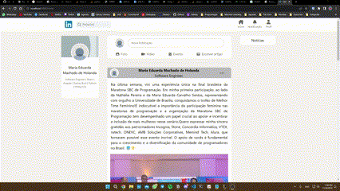

# Frontend for LinkedIn

## About the project

This project is my attempt at recreating the frontend of LinkedIn using:

- React: For building a dynamic and responsive user interface.
- HTML: To structure the content and layout of the application.
- SCSS: A preprocessor scripting language for styling.

I plan to implement web scraping to fetch  my personal data from LinkedIn, to include my profile and posts.

## Running the project locally

You must have [node js](https://nodejs.org/en/) on your machine first. Then run:

```npm install``` \
```npm start```

## Project Overview

